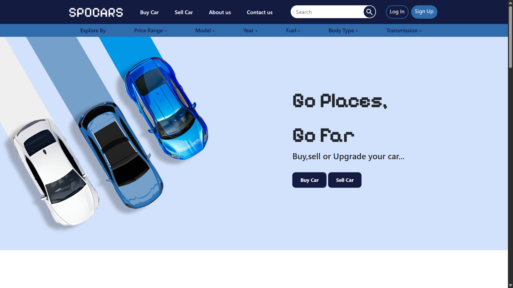

```markdown
# 🚗 SpoCars



A clean and responsive web interface for a car marketplace platform. SpoCars allows users to navigate through a simulated car-buying and selling experience.

## 🌟 Overview
SpoCars is a frontend web project designed to provide a modern, user-friendly interface for an automotive marketplace. It includes essential features like authentication and distinct modules for buying and selling vehicles.

## ✨ Features
* **User Authentication:** Integrated Login and Signup pages.
* **Marketplace Browsing:** A dedicated interface to view and buy cars (`buycar.html`).
* **Vehicle Listing:** A form-based page to list cars for sale (`sellcar.html`).
* **Responsive Layout:** Designed with modern CSS for a clean look.

## 🛠 Tech Stack
* **Frontend:** HTML5, CSS3
* **Structure:** Static web pages with modular organization.

## 📂 Project Structure
```text
SpoCars/
├── css/             # Custom stylesheets
├── img/             # Images and assets
├── index.html       # Homepage
├── login.html       # User login page
├── signup.html      # User registration page
├── buycar.html      # Browse/Buy vehicles page
└── sellcar.html     # Sell/List vehicle form
```

## 🚀 How to Run
1. **Clone the repository:**
   ```bash
   git clone [https://github.com/nishilchavda/SpoCars.git](https://github.com/nishilchavda/SpoCars.git)
   ```
2. **Open the project:**
   Navigate to the folder and open `index.html` in your web browser.

## 📝 License
This project is for educational and portfolio purposes. Feel free to use and modify the code!
```